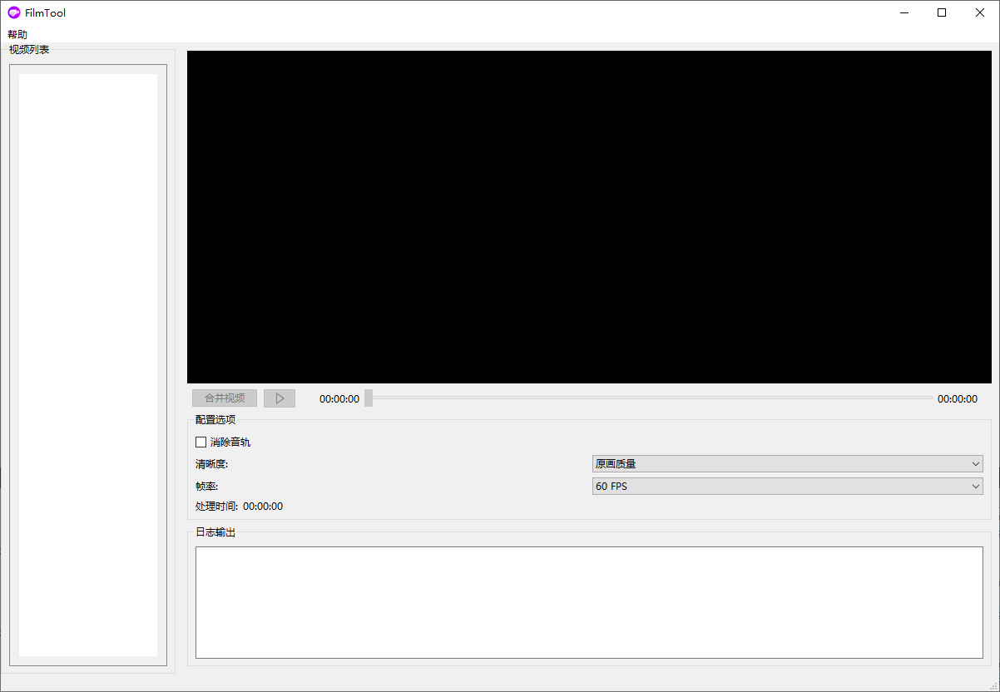

# FilmTool

A powerful video processing tool built with Qt that allows you to manage, preview, and merge video files.

## Features

- 🎥 Video Preview: Built-in video player with playback controls
- 📋 Video List Management: Add, remove, and reorder videos
- 🔄 Video Merging: Combine multiple videos into one
- 🎨 Customization Options:
  - Quality settings adjustment
  - FPS (Frames Per Second) control
  - Audio track removal option
- 👁️ Thumbnail Preview: Automatic thumbnail generation for videos
- ⏱️ Processing Time Tracking
- 📝 Detailed Operation Logs

## Interface

The main interface consists of two main sections:


Left side:
- Video list area with thumbnails
- Drag and drop support for reordering
- Right-click menu for file operations

Right side:
- Video player with controls

- Configuration options
- Processing log output

## Usage Instructions

Watch this quick tutorial to get started:


### Video List Management
- Right-click on the video list area to:
  - Add videos: Select one or multiple video files (supports mp4, avi, mkv formats)
  - Remove videos: Delete the selected video from the list
- Double-click a video to load it into the player for preview
- Drag and drop videos to rearrange their order for merging

### Video Playback
- Click the play button to play/pause the video
- Use the progress slider to adjust the playback position
- Current time and total duration are displayed below the player

### Video Merging
Click "Merge Video" to combine videos with the following options:
- **Audio Track Removal**: Check this option to remove sound from the output video
- **Quality Settings**: Choose from three quality levels
  - Original Quality: Maintains the original video quality
  - Medium Quality: 720p resolution (2Mbps bitrate)
  - Low Quality: 480p resolution (1Mbps bitrate)
- **Frame Rate**: Select between two options
  - 60 FPS: Smooth motion, ideal for action videos
  - 30 FPS: Standard frame rate, suitable for most content
- **Processing Time**: Shows the time spent on video processing
- A progress bar will appear during processing

### Log Output
The log output area displays:
- Processing information in real-time
- FFmpeg command details
- Progress updates
- Any errors or warnings during processing

## Requirements

- Qt 6.x or Qt 5.x
- C++17 compatible compiler
- FFmpeg (included in Windows builds)

## Building from Source

1. Make sure you have Qt and CMake installed
2. Clone the repository
3. Run the following commands:
```bash
mkdir build
cd build
cmake ..
cmake --build .
```

## License

This project is open source and available under the MIT License.

## Easter Egg 🥚

This project was developed with the power of AI assistance:
- Project Lead: gerald057
- Development Environment: Cursor IDE
- AI Pair Programming: Powered by Cursor's AI Assistant

Fun fact: The entire codebase was crafted through human-AI collaboration, showcasing the potential of modern development workflows! 🚀

---

# FilmTool (中文说明)

一个基于Qt开发的强大视频处理工具，可用于管理、预览和合并视频文件。

## 功能特点

- 🎥 视频预览：内置视频播放器及播放控制
- 📋 视频列表管理：添加、删除和重新排序视频
- 🔄 视频合并：将多个视频合并为一个
- 🎨 自定义选项：
  - 质量设置调节
  - FPS（帧率）控制
  - 音轨移除选项
- 👁️ 缩略图预览：自动生成视频缩略图
- ⏱️ 处理时间跟踪
- 📝 详细操作日志

## 界面说明

主界面分为两大部分：


左侧区域：
- 视频列表区域，显示缩略图
- 支持拖拽重新排序
- 右键菜单进行文件操作

右侧区域：
- 视频播放器和控制面板

- 配置选项区域
- 处理日志输出

## 使用说明

观看快速入门教程：


### 视频列表管理
- 在视频列表区域右键点击：
  - 添加视频：选择一个或多个视频文件（支持mp4、avi、mkv格式）
  - 删除视频：从列表中删除选中的视频
- 双击视频可将其加载到播放器中预览
- 通过拖拽可以调整视频的合并顺序

### 视频播放
- 点击播放按钮播放/暂停视频
- 使用进度条调整播放位置
- 播放器下方显示当前时间和总时长

### 视频合并
点击"合并视频"按钮，可以使用以下配置选项：
- **消除音轨**：勾选此选项可以移除导出视频的声音
- **清晰度**：提供三种清晰度选择
  - 原画质量：保持原始视频质量
  - 中等画质：720p分辨率（2Mbps码率）
  - 低清画质：480p分辨率（1Mbps码率）
- **帧率**：提供两种选择
  - 60 FPS：流畅画面，适合动作视频
  - 30 FPS：标准帧率，适合大多数内容
- **处理时间**：显示视频处理所花费的时间
- 处理过程中会显示进度条

### 日志输出
日志输出区域显示：
- 实时处理信息
- FFmpeg命令详情
- 进度更新信息
- 处理过程中的错误和警告

## 系统要求

- Qt 6.x 或 Qt 5.x
- 支持C++17的编译器
- FFmpeg（Windows版本已包含）

## 从源码构建

1. 确保已安装Qt和CMake
2. 克隆仓库
3. 运行以下命令：
```bash
mkdir build
cd build
cmake ..
cmake --build .
```

## 许可证

本项目采用MIT许可证开源。

## 彩蛋 🥚

本项目采用AI辅助开发：
- 项目主导：gerald057
- 开发环境：Cursor IDE
- AI结对编程：由Cursor AI助手提供支持

有趣的是：整个代码库都是通过人机协作完成的，展示了现代开发工作流程的潜力！🚀

